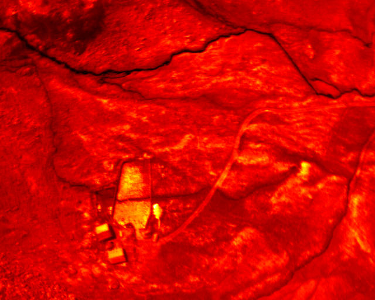
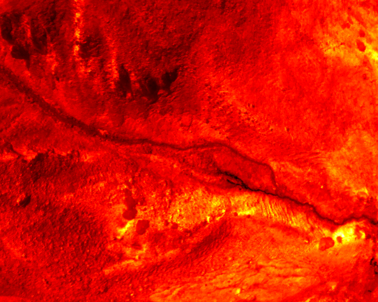

# thermoTIF2PNG.py
Landon Halloran (www.ljsh.ca)

## Description
Simple script to do a batch conversion of TIFF files from a thermal camera (e.g. SenseFly ThermoMap) to PNG files. Useful for rapid analysis of thermal data before more stitching, radiometric, etc. 

The script can also do a global normalisation of values.

This should work for other non-thermal imagery applications too, as long as the input is a greyscale TIFF. A small modification would adapt the script to other input/output formats too...

Please cite this repo if this script is used in any published work.

## Options
- colo(u)r map (see https://matplotlib.org/3.1.0/tutorials/colors/colormaps.html)
- normalisation of max/min values based on individual files OR on max/min across all files

## Example data
Two `.tif` files exported from a SenseFly ThermoMap camera are located in folder `example_input/`.

## Example output
Example data output with settings `globalrange = False` and `colourmap = 'hot'`:

